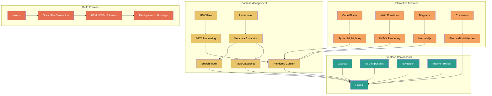

```mermaid
graph TD
    subgraph "Frontend Components"
        A[Layouts] --> B[Pages]
        C[UI Components] --> B
        D[Navigation] --> B
        E[Theme Provider] --> B
    end
    
    subgraph "Content Management"
        F[MDX Files] --> G[MDX Processing]
        G --> H[Rendered Content]
        H --> B
        I[Frontmatter] --> J[Metadata Extraction]
        J --> K[Tags/Categories]
        J --> L[Search Index]
    end
    
    subgraph "Interactive Features"
        M[Code Blocks] --> N[Syntax Highlighting]
        O[Math Equations] --> P[KaTeX Rendering]
        Q[Diagrams] --> R[Mermaid.js]
        S[Comments] --> T[Giscus/GitHub Issues]
    end
    
    subgraph "Build Process"
        U[Next.js] --> V[Static Site Generation]
        V --> W[HTML/CSS/JS Assets]
        W --> X[Deployment to Hostinger]
    end
    
    K --> B
    L --> B
    N --> H
    P --> H
    R --> H
    T --> B
    
    style A fill:#2A9D8F,color:white
    style B fill:#2A9D8F,color:white
    style C fill:#2A9D8F,color:white
    style D fill:#2A9D8F,color:white
    style E fill:#2A9D8F,color:white
    style F fill:#E9C46A,color:black
    style G fill:#E9C46A,color:black
    style H fill:#E9C46A,color:black
    style I fill:#E9C46A,color:black
    style J fill:#E9C46A,color:black
    style K fill:#E9C46A,color:black
    style L fill:#E9C46A,color:black
    style M fill:#F4A261,color:black
    style N fill:#F4A261,color:black
    style O fill:#F4A261,color:black
    style P fill:#F4A261,color:black
    style Q fill:#F4A261,color:black
    style R fill:#F4A261,color:black
    style S fill:#F4A261,color:black
    style T fill:#F4A261,color:black
    style U fill:#E76F51,color:white
    style V fill:#E76F51,color:white
    style W fill:#E76F51,color:white
    style X fill:#E76F51,color:white
```